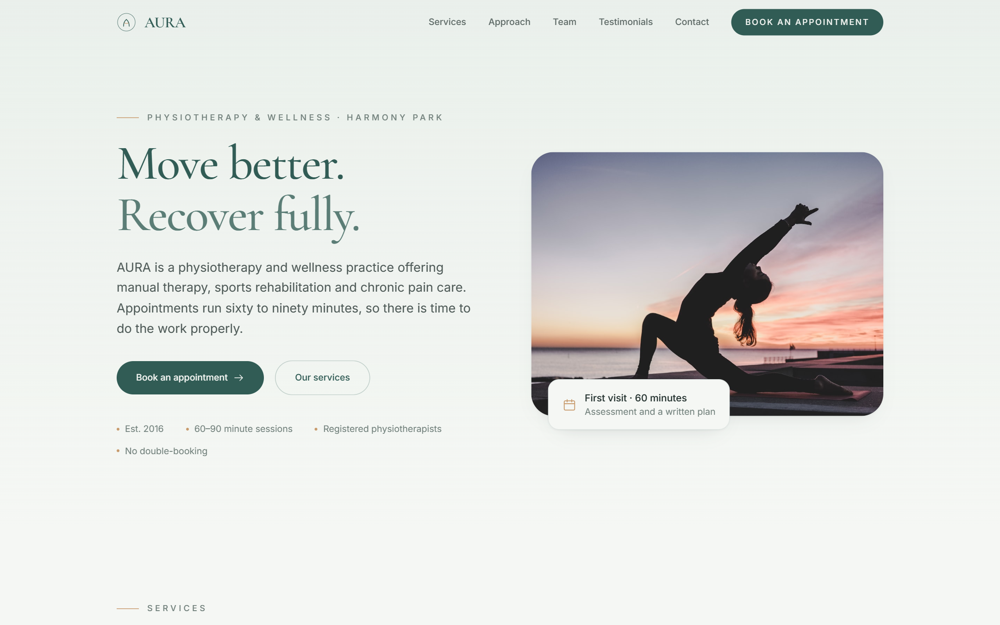
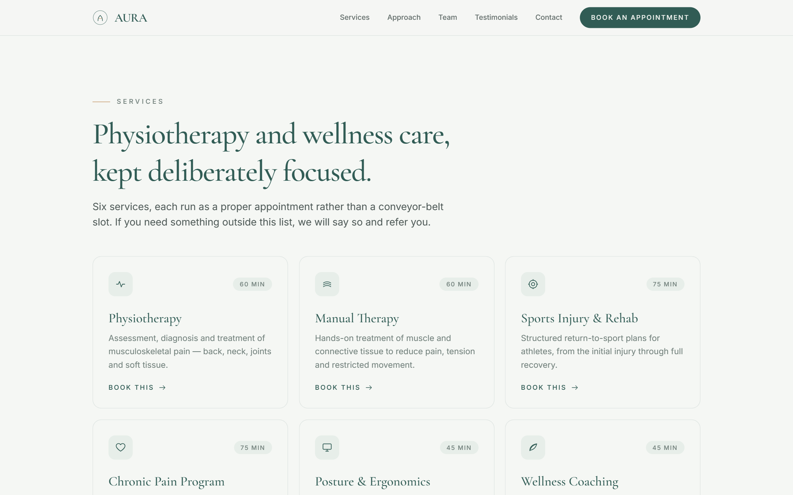
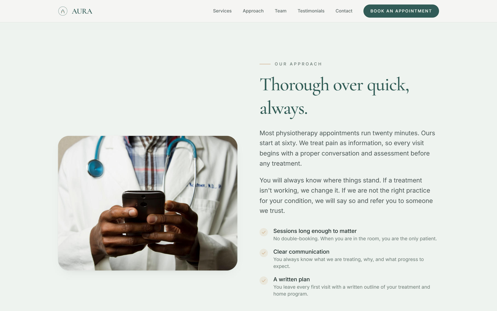
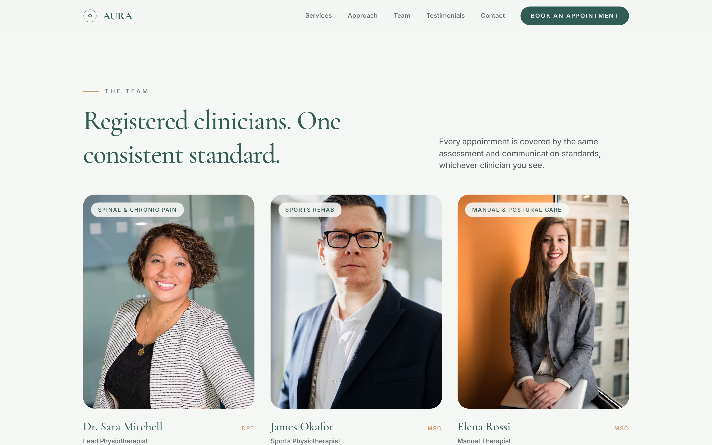
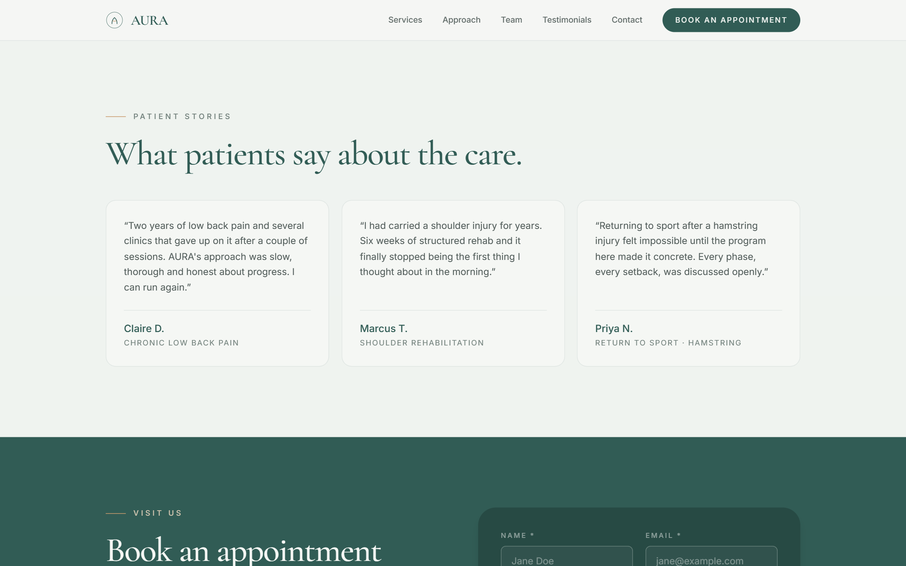
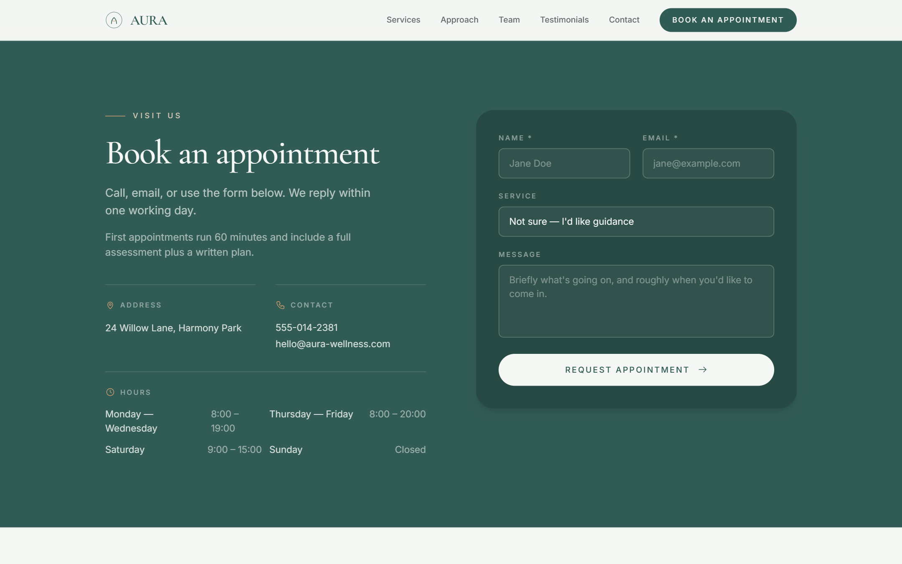

# AURA

Landing page for a fictional physiotherapy and wellness practice. Built as a portfolio piece.

React, Vite, Tailwind CSS v4. The colour palette comes from the AURA brand system.

Live site: **https://aura-taupe-phi.vercel.app/**

## Screenshots













## Run it

```sh
npm install
npm run dev
```

Build for production with `npm run build` (`dist/`), preview with `npm run preview`.

## Structure

- `src/data/content.js` — all the copy (hero, services, approach, team, testimonials, visit). Editing text is a one-file job.
- `src/components/` — one component per section.
- `src/index.css` — theme tokens plus the single keyframe used (reveal).

## Palette

Defined once in `@theme` and referenced everywhere. No stray hex values.

| Role | Hex |
|---|---|
| Primary | `#315C55` |
| Primary deep | `#274A44` |
| Primary soft | `#5B7D76` |
| Secondary | `#6F9089` |
| Background | `#F5F7F4` |
| Surface | `#E7EEE9` |
| Text | `#24322F` |
| Muted | `#71807B` |
| Accent | `#C89B6D` |
| Accent light | `#E7D4BD` |

## Known rough edges

- Photos are local placeholders from Unsplash. Swap them for real clinic photos — they're referenced in `src/data/content.js`.
- The appointment form is front-end only. It swaps to a confirmation state; there's no backend behind it.
- `scroll-mt-16` on each section compensates for the fixed header. If the header height changes, those need a revisit.

---

**Built from scratch by [Hamid Mbairik](https://github.com/HamidMbairik) · [CorgaDev](https://corgadev.vercel.app) — custom websites, no templates.**
